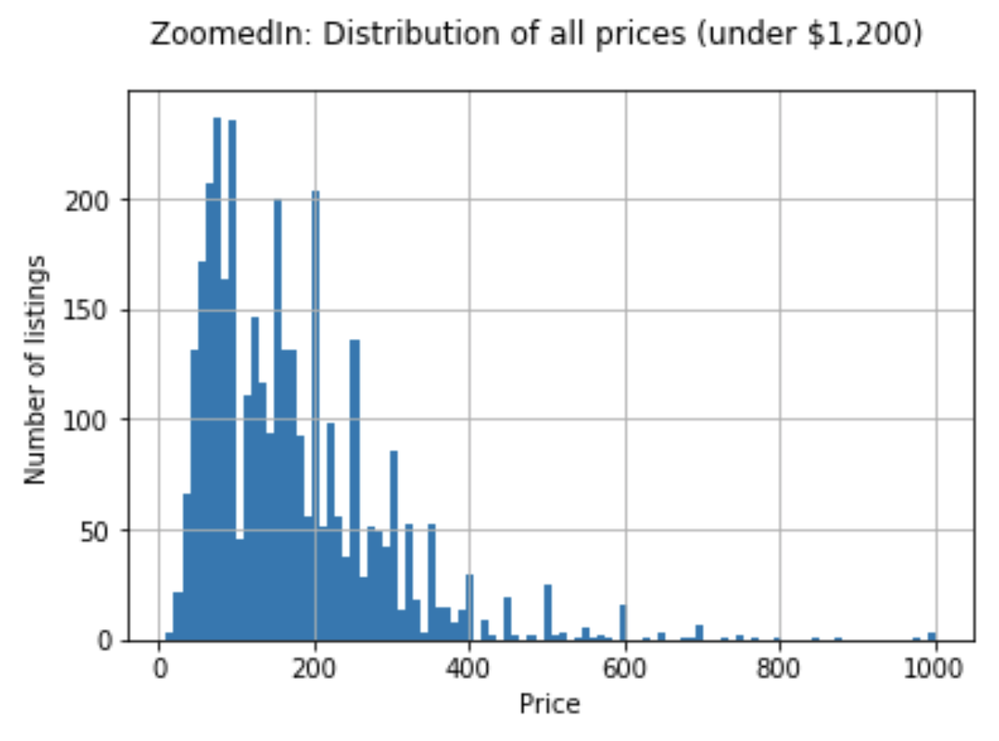
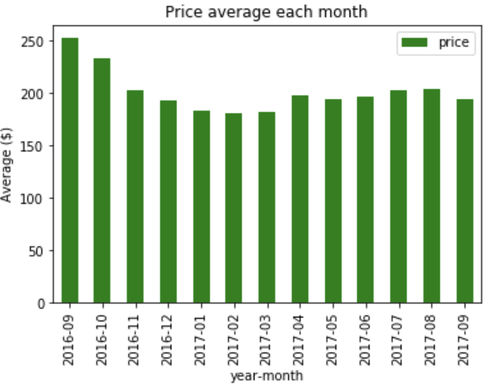
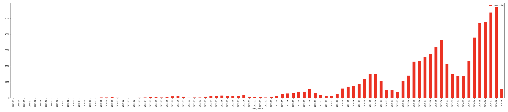

# Boston Airbnb Prices Dataset


## Introduction:

This Project is part of Data Science Nanodegree Program by Udacity. Provided are datasets containing information about pricing for Airbnb in Boston. The dataset is provided by and available at kaggle.

In this project I analyse the data to address the following three questions stated:
* What is the price distribution for each room type?
* How is the price changing over time (count in months) and what are the top 5 average most expensive zipcodes all time?
* What is the distribution of demand over the entire time, per month?

Refer to the content of my notebook for technical details of the procedure and commentaries on the results. 
## Requirements:
* python 3.x,
* numpy, 
* pandas, 
* matplotlib

## Installation:
Clone the following repository:
```
git clone https://github.com/hanacicia/dsnd-boston-airbnb.git
```
## Insights:
I provided some highlights of the analysis below. We can see the price distribution clipped for the max price of 1200USD (for clear visibility, to avoid outliers):


Further, we can see the average prices for the whole city over one year between 2016 Sep. and 2017 Sep., remaining steady.



Lastly, we can see how the demand for rental increased since 2009. Especially it took pace in the last 4 years, with seasonal peaks around september and october.



## Acknowledgements:
The credits go to Udacity for conducting the Nanodegree and the Project, while the dataset being offered by Kaggle.

